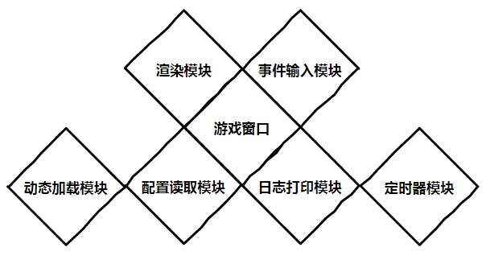
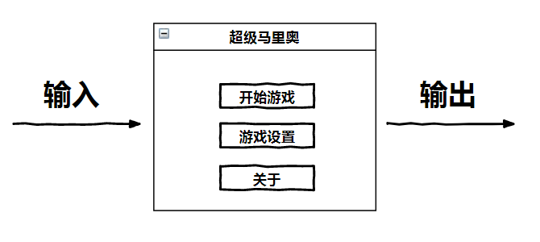
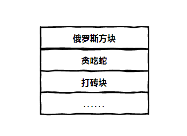
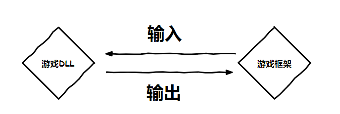
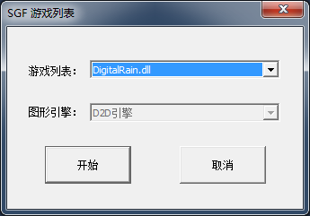
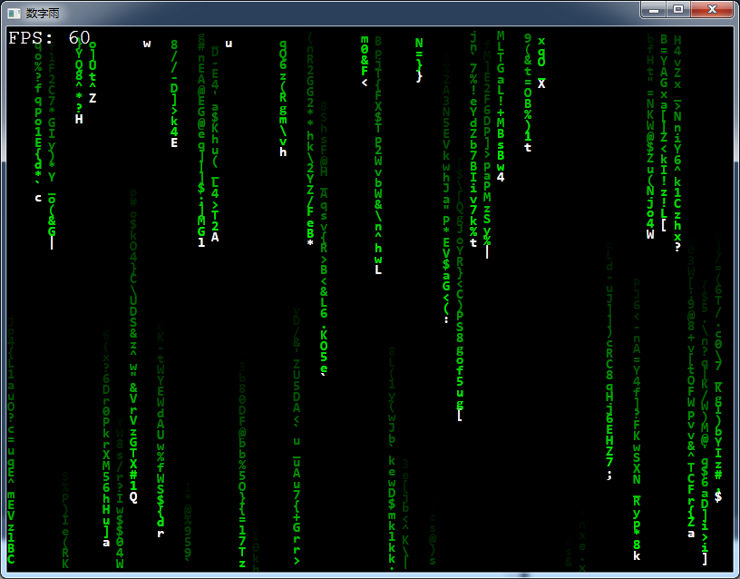
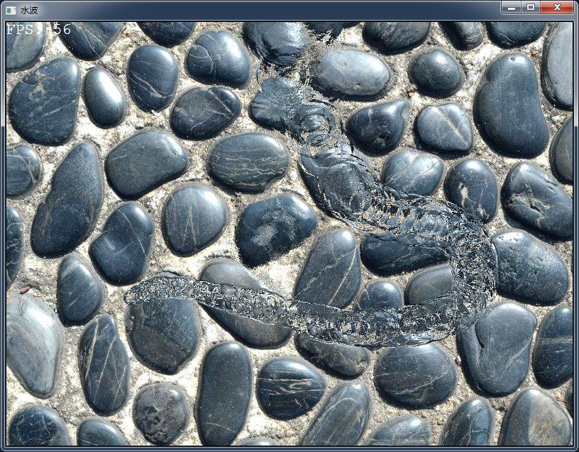

# 搭建简单游戏框架

> SGF —— Simple Graphics Frame

## 1. 前言

在上大学期间，心里面一直有一个愿望就是制作一个自己的游戏，但是惰性太强，达不到知行合一，更多的是想法，缺少实际行动，最后也就不了了之了。最近翻看自己过去记录的想法，突然想要去将它们逐一实现，不知道能否坚持下去，但不管怎样得先有些行动再说。

## 2. 目标

这篇文章的目的主要是抽象出一个简单的游戏框架，让以后的文章尽量少涉及窗口相关的工作，这样可以更加专注游戏本身的逻辑。

游戏框架其实可以复杂也可以简单，本系列的游戏都属于小型游戏，所以也只是想要抽象出一个方便使用的库而已，目前需要实现以下几个模块：

+ 日志输出模块，负责打印日志，帮助程序调试。
+ 定时器模块，独立的模块，主要是实现定时器的功能。
+ 配置读取模块，独立的模块，主要是提供配置文件的读写。
+ 鼠标、键盘事件输入模块，负责鼠标和键盘事件的捕获。
+ 图形绘制模块，负责图形界面的绘制。
+ 自动加载模块，负责游戏DLL的加载。

## 3. 分析

任何一个程序都存在输入和输出，大致如下图所示：

对于输入，主要是两种：键盘和鼠标。

对于输出，主要就是屏幕绘制。

在接下来的文章中，每个游戏将被封装成为一个DLL模块，内部包含所有的游戏逻辑。这样在运行游戏的时候只是动态加载相应的DLL，就会显示对应的游戏内容。

游戏运行的时候，可以动态检索一个指定的目录，显示所有目录下的游戏，如果存在多个游戏则弹出一个对话框让用户选择。

DLL和游戏框架之间都存在一套接口，便于二者之间的通讯。主要包含两个方面：

+ 输入，主要是游戏框架捕获事件，通过接口通知游戏DLL。
+ 输出，主要是游戏DLL调用游戏框架提供的接口实时渲染图像到界面。

## 4. 实现

刚开始的时候准备用C语言实现，但是因为C语言缺少一些本人喜欢的机制，例如重载、默认值、引用、智能指针、STL、面向对象等等，加上这个项目是休闲项目，全凭个人心情，所以最后还是决定选择了C++语言进行开发（及时对C++掌握的很烂）。不过接下来的游戏开发文章主要的内容将会所有语言通用，会尽量抽象些，多写一些独立于实现细节之外的内容。

框架的代码一共花费了一周的时间，主要最近总是加班，没有时间，但靠着周末还是实现了一个简单的初始框架，随着游戏的开发会逐渐完善。代码运行在windows，工程文件是vs2017，所以早期的IDE未必能够打开，不过可以尝试建立win32工程，把代码移植过去。代码中会用一些C++最新的特性，主要是学习练手，所以移植的编译器至少需要支持C++11。

目前代码已经可以运行：

默认有两个Demo仅供参考，代码来源自以前的工程。

数字雨：

水波：

代码地址：https://github.com/WangZhechao/sgf